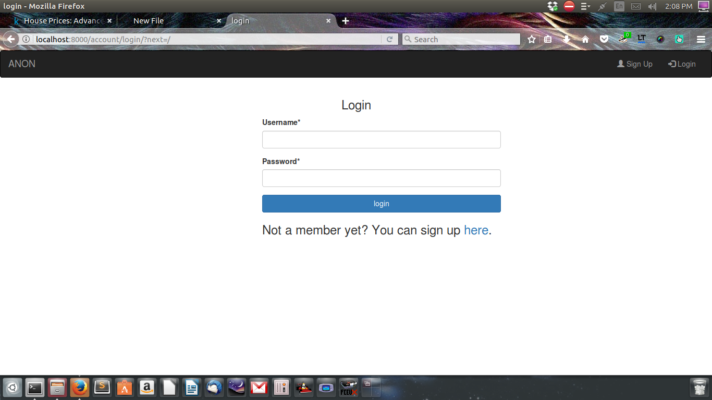
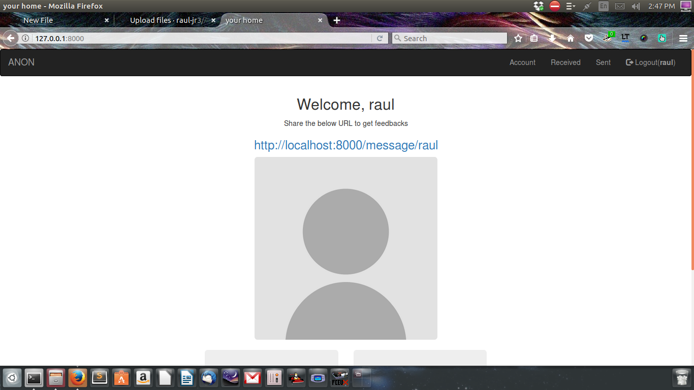

# ANON

### a site to create dedicated user pages which can be shared with other people and receive feedbacks
### in order to write to a person, a registered account is needed.
### the responder can remain anonymous or can reveal identity.

# Installation
1. Create a new directory and cd into it.
2. Clone this repository.
3. Create a virtual environment by running <b><code>virtualenv -p python3 your_virtualenv_name</code></b>
4. Activate the virtual environment <b><code>source your_virtualenv_name/bin/activate</code></b>
5. cd into the ANON directory.
6. Now run <b><code>pip install -r requirements.txt</code></b>
7. Run <b><code>python manage.py runserver</code></b>

# now navigate to "http://127.0.0.1:8000/"

you should see this...

register a new account

### if you use localhost instead of 127.0.0.1, the captcha won't work

then sign-in.....

Now, you should see this....

to change the url, make the necessary changes in private_page.html
